:::message
筆者の考えを元にAIを使用して執筆しています。
:::

AIコーディングエージェントの隆盛により、開発タスクにおける人間の仕事は課題設定と意思決定にシフトしつつある。そうした背景もあり、改めて問題解決の基礎を整理することにした。問題解決は「すぐに解決策を考える」ことではない。本当に解くべき問題を見極め、構造的に分解し、仮説と検証のサイクルを回すことが本質である。

## 問題と課題の本質

### 問題（Problem）とは何か

問題とは「現状（As Is）」と「あるべき姿（To Be）」のギャップである。

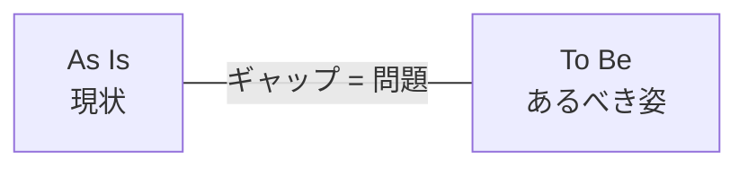

このシンプルな定義が重要な理由は、問題を語るためには必ず「前提」が必要だということ。前提が異なれば、同じ現状でも問題の捉え方は変わる。

例：
- 前提A「売上は成長し続けるべき」→ 売上横ばいは問題
- 前提B「利益率を維持すべき」→ 売上横ばいは問題ではない可能性

### 前提を定義する

問題を定義する前に、「変えられないこと」を明確にする必要がある。前提が曖昧なまま問題解決を進めると、途中で「そもそもそれは変えられない」と判明して手戻りが発生する。

#### 前提の明示化

1. **前提を洗い出す** - 暗黙の前提を言語化する。「当然こうだろう」と思っていることを列挙
2. **変えられるか確認する** - 本当に変えられないのか、それとも変えないと決めただけなのか検証

#### 現状の整理

同じ現状でも、何を制約として扱うかで課題の定義は全く変わる。

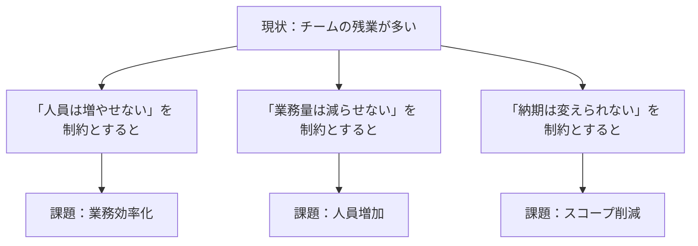

ここで重要なのは、「人員は増やせない」などは本当の制約（物理的・法的に不可能）ではなく、前提（変えないと決めたこと）である可能性が高いということ。前提を問い直すことで、より良い解が見つかることもある。ただし、前提を変えるには通常、より上位の意思決定者やステークホルダーとの交渉が必要になる。

#### 前提と制約の違い

| | 制約 | 前提 |
|---|------|------|
| **定義** | 物理的・法的に変えられない | 変えられるが、変えないと決めた |
| **例** | 法律、物理法則、契約 | 予算、スコープ、方針、納期 |
| **扱い** | 受け入れる | 問い直す余地がある |

ここでは、前提と制約を上記の定義として扱う。前提を制約と混同すると、本来は変えられる選択肢を見落とす。「それは本当に変えられないのか？」と問い直すことが、真の課題を見極める第一歩になる。

### Problem と Issue の違い

英語では problem と issue を区別する。この区別が問題解決の質を変える。

| | Problem | Issue |
|---|---------|-------|
| **焦点** | 望ましくない状態・ギャップ | 決めるべき論点・争点 |
| **性質** | 「何かがおかしい」 | 「どうするか決まっていない」 |
| **行動** | 解決すべき | 意思決定すべき |

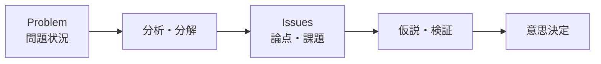

イシューとは「答えを出す価値のある本質的な問い」。問題解決の鍵は、漠然とした problem から具体的な issue を抽出することにある。

## 問題解決のプロセス

### 全体像


*問題の認識からフィードバックまで、各ステップを反復しながら進める*

このプロセスは直線的ではなく、フィードバックループを持つ。検証結果によって仮説を修正し、ときには問題の認識自体を見直す。

### イシュードリブンなアプローチ

イシュードリブンとは、「何を解くか」を最初に見極めるアプローチ。

100の問題があっても、本当に答えを出すべき問題は2〜3個。残り97〜98個に時間を使うのは犬の道であり、バリューのある仕事は生まれない。

よいイシューの条件：

1. **本質的な選択肢である** - 答えによって意味合いが大きく変わる
2. **深い仮説がある** - 常識を覆す、新しい構造で説明するなど
3. **答えを出せる** - 手持ちの技術・手法で検証可能

## 論理的思考の構造

問題解決には論理的思考が不可欠である。しかし「論理的」とは何を意味するのか。

### 論理的ではない思考

以下のような思考は、一見もっともらしく見えても論理的ではない：

- 「若者のユーザーは、…といっている」
- 「売上の伸びが鈍化…」
- 「業界のエキスパートは、…といっている」
- 「過去のベストプラクティスは…」
- 「最近の競合の動きは、…」

これらは**情報を羅列しているだけ**で、**情報の関連性・重要性が明確ではない**。事実やデータを並べることと、論理的に考えることは別物である。

### 論理的とは何か

論理的であるとは、「**話が縦にも横にもきちんとつながっている**」ことである。

| 方向 | 意味 | チェックポイント |
|------|------|------------------|
| **縦の論理** | 因果関係が整理されている | 「本当にそうなの？」（話が飛んでいないか） |
| **横の論理** | 全体が網羅されており抜け漏れ重複がない | 「本当にそれだけ？」（抜けていないか） |

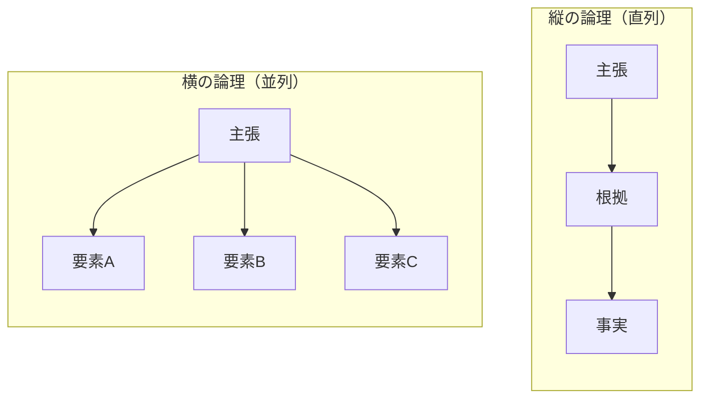
*縦の論理は「本当にそうなの？」、横の論理は「本当にそれだけ？」で検証する*

**縦の論理と横の論理の両方が満たされれば、人は誤解や違和感なく理解できる。**

## 縦の論理

縦の論理を構成する方法は2つある。**帰納法**と**演繹法**である。

| 方法 | 定義 | 特徴 |
|------|------|------|
| **帰納法** | 具体的な例を挙げて共通項を導く | 複数事例からパターンを発見 |
| **演繹法** | 前提を積み重ねて必然的に導く | 前提が正しければ結論も正しい |

### 具体例：子供が親に靴を買ってもらうとき

**帰納法の例：**

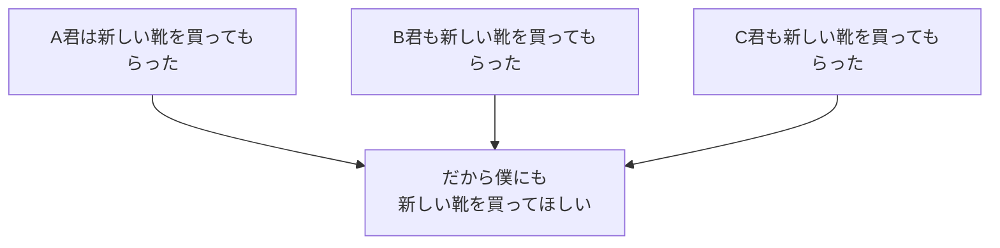

**演繹法の例：**

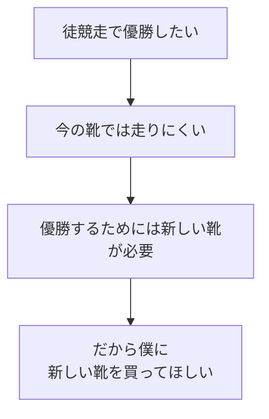

どちらも「新しい靴を買ってほしい」という結論に至るが、説得の構造が異なる。帰納法は「みんなが持っている」という事実の集積、演繹法は「目標達成に必要」という論理の連鎖で支える。

### Why So? と So What?

縦の論理を検証する2つの問いがある。

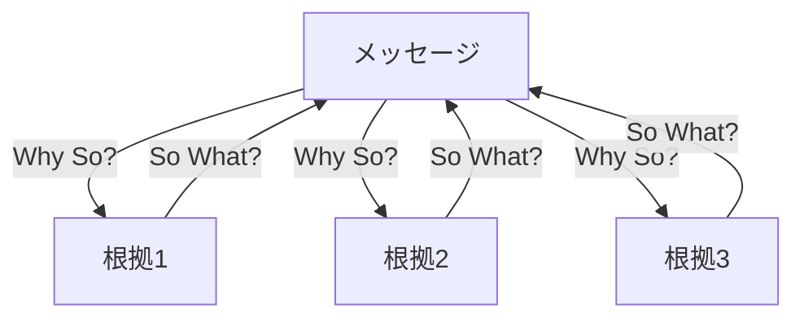

| 問い | 方向 | 意味 |
|------|------|------|
| **Why So?** | 上→下 | 「なぜそう言えるのか？」メッセージを根拠で支える |
| **So What?** | 下→上 | 「だから何？」得られた情報から言えそうなことを抽出する |

**ビジネスでの具体例：**

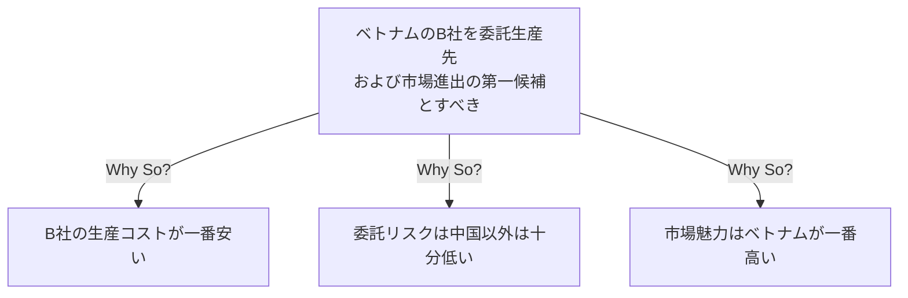

**「帰納法」か「演繹法」で、メッセージを根拠で支える**のが縦の論理の基本である。

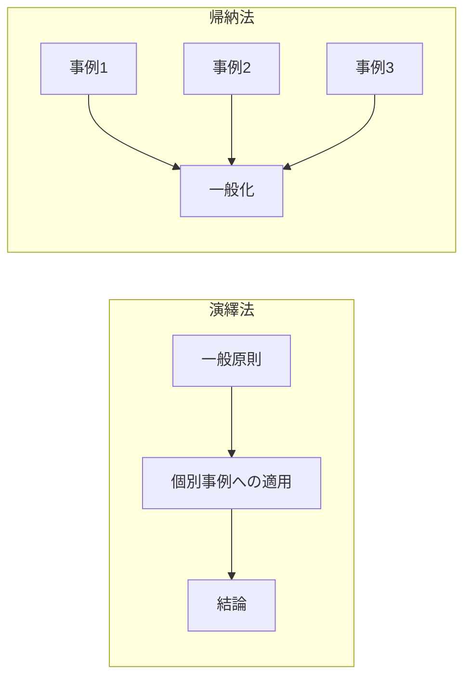

## 横の論理

大きな問題をそのまま解くことはできない。答えを出せるサイズまで分解する技術が必要。横の論理を構成するのは**MECE**と**Grouping**である。

### MECE（Mutually Exclusive, Collectively Exhaustive）

「漏れなく、ダブりなく」分解する原則。考えるポイントを抜け漏れダブりなく分解することで、横の論理を担保する。


*左：Good MECE（重なりなし、隙間なし）、右：Bad（重複=Overlap と隙間=Gap あり）*

#### MECEの4つの作り方

| 方法 | 説明 | 例 |
|------|------|-----|
| **二分割（A−Not A）** | 対立概念で二分する | 国内/海外、新規/既存、大企業/中小企業 |
| **プロセス分割** | 時間・手順の流れで分ける | 訪問→商談→見積→契約 |
| **数式分割** | 数式の構成要素で分ける | 売上 = 市場規模 × シェア |
| **フレームワーク分割** | 既存の枠組みを使う | PEST、3C、4Pなど |

**二分割（A−Not A）の例：**

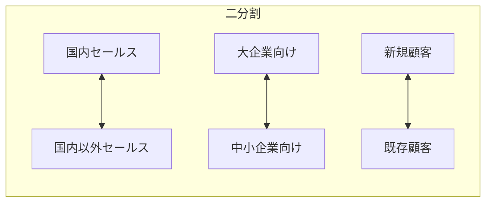

**プロセス分割の例：**

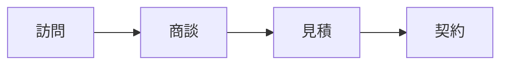

**数式分割の例：**

| 分解式 |
|--------|
| 売上 = 社員数 × 社員一人当たり売上 |
| 売上 = 市場規模 × シェア |
| 売上 = A事業部売上 + B事業部売上 + C事業部売上 |

**フレームワーク分割の例（PEST）：**

| 要素 | 内容 |
|------|------|
| P（Politics） | 政治・法改正など |
| E（Economics） | 経済・景気動向など |
| S（Society） | 社会・人口動態など |
| T（Technology） | 技術・新技術など |

### Grouping

要素をグルーピングして意味ある順序にまとめることで、横の論理を担保する。

#### Groupingの3つの根拠

| グルーピング方法 | 説明 | 並べ方 |
|------------------|------|--------|
| **因果の因** | 果の根拠となる因でまとめる | 時間の順序（プロセス順） |
| **部分/全体の部分** | 全体を構成する部分でまとめる | 構造の順序（上流→下流など） |
| **類似するもの** | 意味・形状・性質などでまとめる | 度合いの順序（重要度、規模など） |

**因果の因（時間の順序）：**

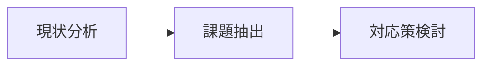

結果をもたらす行動が原因になり、一連のプロセスとして表される。

**部分/全体の部分（構造の順序）：**

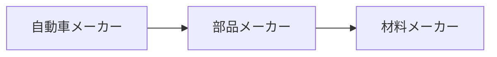

組織や産業などの全体システムは、各サブシステムの集合体として表される。

**類似するもの（度合いの順序）：**

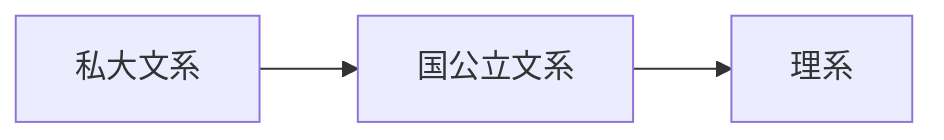

類似するものはすべてを網羅しているわけではなく、一部の抜粋として表される。

### ロジックツリー

問題を木構造で分解する手法。分解の切り口によって複数の型がある。

#### Where型（どこに問題があるか）

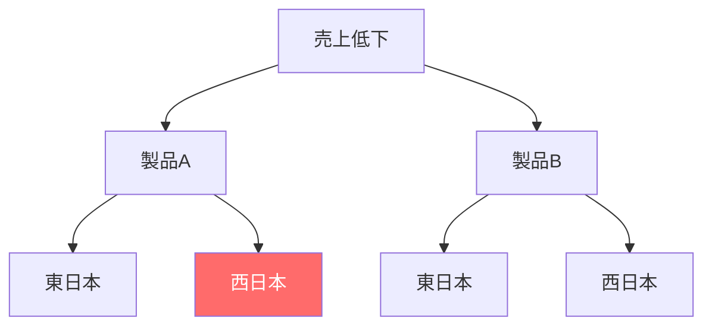

#### What型（何が問題か）

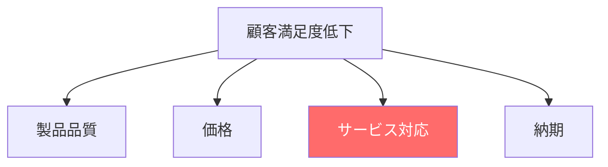

#### Why型（なぜ問題が起きているか）

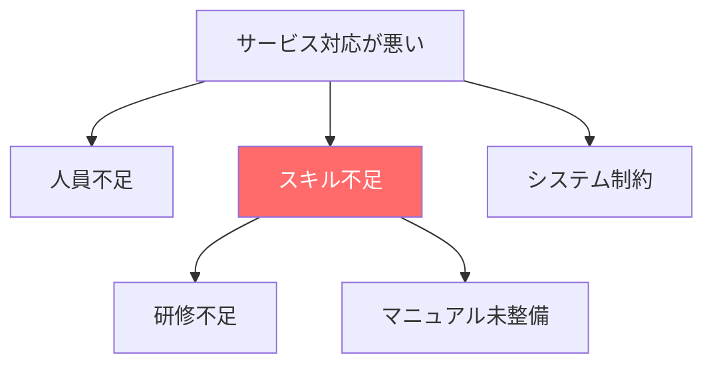

#### How型（どうやって解決するか）

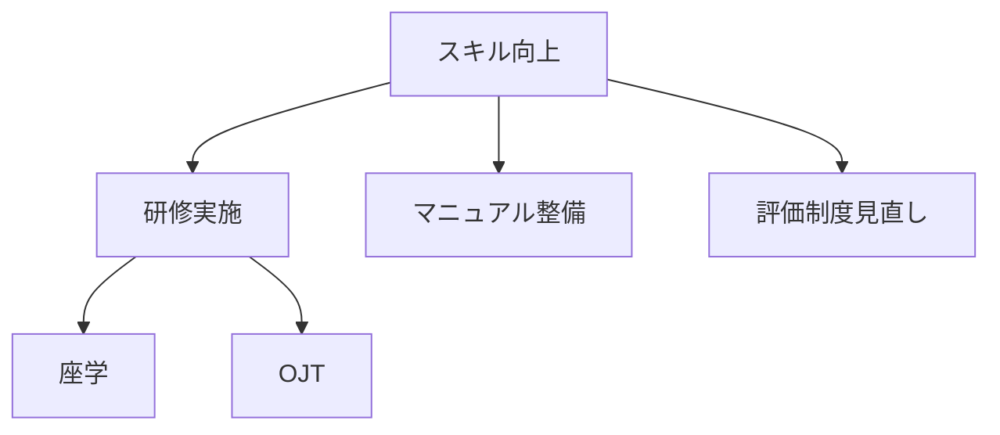

### 分解の視点

同じ問題でも、切り口によって見える世界が変わる。複数の切り口を試すことで、問題の本質に迫れる。

| 切り口 | 例 |
|--------|-----|
| プロセス | 調達→製造→販売→アフターサービス |
| 顧客セグメント | 法人/個人、業種別、規模別 |
| 時間軸 | 過去→現在→未来 |
| 地理 | 地域別、国別 |
| 製品/サービス | カテゴリ別、SKU別 |
| 4P/4C | Product, Price, Place, Promotion |

## ピラミッド構造

論理的な思考や説明は「ピラミッド構造」で表現できる。ピラミッド構造では、縦と横の論理が共に適切である必要がある。

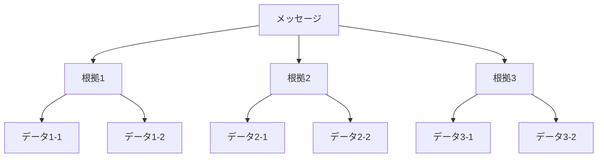

| 方向 | 構成要素 | 役割 |
|------|----------|------|
| **縦の論理** | Why So? / So What? | メッセージを根拠で支える / 情報から意味を抽出する |
| **横の論理** | MECE / Grouping | 抜け漏れダブりなく分解 / 意味ある順序で並べる |

## 具体と抽象の往復

問題解決では、観察の粒度を意識的に切り替える必要がある。


*具体と抽象の往復（事象→原理→解決策）*

### 観察の粒度としての具体⇔抽象

| 思考の方向 | 特徴 | 使いどころ |
|------------|------|------------|
| 具体化 | 詳細に落とし込む、事例を挙げる | 検証フェーズ、実行計画 |
| 抽象化 | 本質を抽出、共通項を見出す | 問題の構造化、パターン認識 |

問題解決では具体と抽象化を往復する。具体的な事象から抽象的な構造を見出し、その構造を別の具体的な状況に適用する。

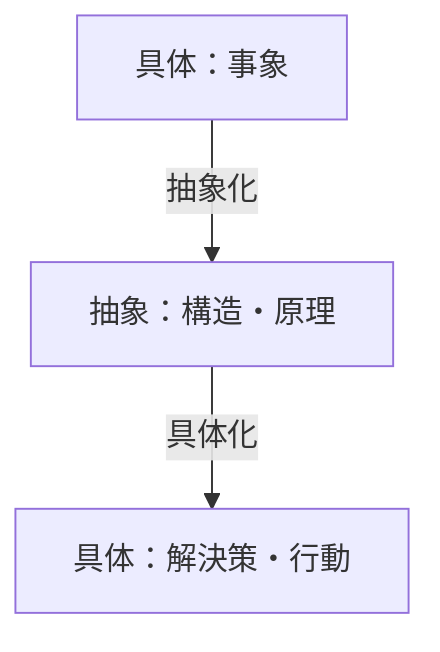

### 仮説生成のプロセス

「システムが遅くなった」という観察から「データベースのクエリが原因ではないか」という仮説を立てる。この仮説生成は、しばしばアブダクション（仮説的推論）と呼ばれ、演繹・帰納と並ぶ「第三の推論形式」として紹介されることが多い。

しかし、アブダクションを演繹・帰納と同列に扱うことには問題がある。

**アブダクションの形式的構造：**

```
もし H ならば E が起きる
E が観察された
∴ H である
```

これは論理学では「後件肯定の誤謬」と呼ばれる形式であり、妥当な推論ではない。

**仮説生成の実際のプロセス：**

実際に仮説を「思いつく」過程を観察すると、複数の要素が組み合わさっている：

1. **帰納的要素** - 「前にも似たような遅延があり、そのときはDBが原因だった」という過去の事例からのパターン認識
2. **演繹的要素** - 「クエリが重いとレスポンスが遅くなる」という既知の原理の適用
3. **問いの設定** - 「何が説明変数になりうるか」という視点の選択

つまり仮説生成は、帰納・演繹・問いの設定の**複合プロセス**である。「アブダクション」という名前は、この複合プロセスの**結果**（仮説が生まれること）に名前を付けたものである。

仮説思考で重要なのは、この複合プロセスを意識的に回すこと。そして生成された仮説は必ず検証が必要である。

### フェーズごとの思考の対応

| フェーズ | 主な思考 |
|----------|----------|
| 問題認識 | 抽象化、前提の問い直し |
| イシュー特定 | 具体化、前提の問い直し |
| 課題分解 | 抽象化、演繹（MECE適用） |
| 仮説構築 | 帰納（パターン認識）、演繹（原理適用）、問いの設定 |
| 検証 | 演繹、具体化 |
| フィードバック | 帰納、前提の問い直し |

## 前提を問い直す思考

問題解決において、帰納・演繹は「縦の論理」を構成する推論形式である。一方、「前提を問い直す」という行為は、推論形式とは異なる次元の思考である。

### メタ認知とは

自分の思考を客観視する認知。「なぜ自分はこの問題を問題と捉えているのか」を問う。

| レベル | 思考内容 |
|--------|----------|
| **通常の認知** | この問題を解こう |
| **メタ認知** | なぜこれを問題と捉えているのか？前提は正しいか？ |

### 前提を問い直す4つの場面

メタ認知が特に重要になる場面は4つある。

#### 1. 問題定義時：前提の明示化

問題を定義する際に、暗黙の前提を言語化する。「前提を定義する」セクションで述べた通り、前提が曖昧なまま進めると手戻りが発生する。

- 「変えられないこと」を洗い出す
- 「変えられるが変えないと決めたこと」を区別する

#### 2. 仮説生成時：問いの設定

仮説を生成する際に、「何を説明変数として考えるか」という問いを設定する。この問いの設定自体がメタ認知である。

- 「この現象を説明する要因として何が考えられるか？」
- 「過去の類似事例では何が原因だったか？」
- 「どの切り口で分析するのが効果的か？」

#### 3. 分析を通じた前提の洗練

分析を進める中で、前提の解像度が上がることがある。最初は曖昧だった前提が、具体的なデータや事例に触れることで精緻化される。

```mermaid
flowchart LR
    A[仮説構築] --> B[検証・分析]
    B --> C[前提の解像度向上]
    C --> D[課題設定の更新]
    D --> A
```

**前提の洗練パターン：**

| パターン | 例 |
|----------|-----|
| **適用範囲の限定** | 「顧客は価格に敏感」→「新規顧客は価格に敏感だが、既存顧客はサービス品質を重視」 |
| **定義の精緻化** | 「生産性が低い」→「定型業務の処理速度は問題ないが、非定型業務の着手が遅い」 |
| **条件の発見** | 「このシステムは遅い」→「データ量が閾値を超えると急激に遅くなる」 |

このフィードバックループを回すことで、最初に設定した課題が変わることは珍しくない。むしろ、課題設定が変わらないまま分析が進むときこそ、前提を問い直すべきサインかもしれない。

#### 4. 行き詰まり時：真の課題の発見

問題解決が行き詰まったとき、前提自体を問い直すことで突破口が見つかる。

- 「そもそもこの問題設定は正しいか？」
- 「別の前提を置いたらどうなるか？」
- 「制約だと思っていたものは本当に変えられないのか？」

### シングルループとダブルループ

ダブルループ学習の概念は、前提を問い直す思考を理解する上で重要。


*青の内側ループ：手段の改善に留まるシングルループ、オレンジの外側ループ：前提自体を問い直すダブルループ*

| ループ | 焦点 | 問い |
|--------|------|------|
| **シングルループ** | 手段の改善 | 「どうやって目標を達成するか？」 |
| **ダブルループ** | 前提の見直し | 「その目標は正しいか？前提は妥当か？」 |

表面的な問題に囚われている状態は、シングルループに閉じ込められている状態。メタ認知でダブルループに移行することで、真の課題に到達できる。

## 真の課題を見極める

### 表面的な問題から深層へ

最初に認識される問題は、往々にして「表面的」である。

```mermaid
flowchart TB
    S1[表面的な問題<br>チームの生産性が低い]
    S1 -->|なぜ？| S2[中間的な問題<br>メンバーのスキルが足りない]
    S2 -->|なぜ？| S3[真の課題<br>採用基準が曖昧で<br>評価とフィードバックの仕組みがない]:::root
    classDef root fill:#4ecdc4,color:#fff
```

表面的な問題に対する解決策（研修を増やす）は対症療法に過ぎない。真の課題（採用・評価の仕組み）に取り組まなければ、問題は繰り返される。

### 分析から課題を抽出する

真の課題を見極めるとは、縦と横の論理で分析した結果から「問題に効果的にアプローチできる課題」を抽出することである。

```mermaid
flowchart LR
    A[横の論理で分解] --> B[縦の論理で深掘り]
    B --> C[説明変数の特定]
    C --> D[課題候補の評価]
    D --> E[課題の選定]
```

#### 横の論理：問題の構造を把握する

MECEで問題を分解し、どこに問題があるかを特定する。

| 分解の切り口 | 問い |
|--------------|------|
| **プロセス** | どの工程で問題が発生しているか？ |
| **リソース** | 人・モノ・金・時間のどこに制約があるか？ |
| **構成要素** | どの部分・機能に問題があるか？ |

#### 縦の論理：因果関係を追求する

Why So?で因果を掘り下げ、根本的な説明変数を特定する。

| 深掘りの観点 | 問い |
|--------------|------|
| **スキル** | 必要な能力と現状のギャップは？ |
| **仕組み** | ルール・制度・システムに問題はないか？ |
| **インセンティブ** | 望ましい行動を促す構造になっているか？ |

#### 課題候補の評価

分析で特定した説明変数から課題候補を導出し、So What?で意味合いを抽出する。

| 評価軸 | 問い |
|--------|------|
| **効果** | この課題を解いたら、問題はどの程度解決するか？ |
| **持続性** | 一時的な改善か、恒久的な解決か？ |
| **実現性** | 現在の前提・制約の下で実行可能か？ |
| **副作用** | 解決によって新たな問題が生じないか？ |

### 課題のレベル感

課題には「対症療法」から「構造改革」までレベルがある。どのレベルで介入すべきかを見極める必要がある。

| レベル | 介入対象 | 例 | 効果の持続性 |
|--------|----------|-----|--------------|
| **対症療法** | 症状 | エラーが出たら手動で修正 | 低（再発する） |
| **オペレーション改善** | 作業方法 | チェックリストを導入 | 中（人に依存） |
| **仕組み改善** | ルール・制度 | 承認フローを変更 | 高（仕組みで担保） |
| **構造改革** | 組織・システム | 部門再編、システム刷新 | 最高（根本解決） |

#### レベル選択の判断軸

- **同じ問題が繰り返されている** → より上位レベルでの介入を検討
- **複数の部門・プロセスにまたがる** → 仕組み改善または構造改革
- **インセンティブ構造が問題** → 構造改革が必要な可能性
- **リソース制約が厳しい** → 実現可能なレベルから着手

構造改革は効果が高いがコストとリスクも大きい。「最小の介入で最大の効果」を狙うなら、まず仕組み改善で対応できないかを検討し、それでも不十分な場合に構造改革を選択する。

### 問い直しの技法

真の課題に到達するには、「前提を問い直す思考」で述べたメタ認知を実践する。具体的な問い直しの技法は以下の通り。

1. **前提を疑う**：「本当にそれは問題か？」
2. **視点を変える**：「別の立場から見たらどうか？」
3. **時間軸を変える**：「1年後、5年後にも問題か？」
4. **スケールを変える**：「これは部分の問題か、全体の問題か？」

これらの問いを通じて、シングルループ（手段の改善）からダブルループ（前提の見直し）に移行し、真の課題に到達できる。

### 「解くべきでない問題」を見極める

すべての問題を解く必要はない。以下の問いで、本当に取り組むべきかを判断する：

1. **今、答えを出す必要があるか？**（タイミング）
2. **答えが出たとして、行動が変わるか？**（アクショナブル）
3. **自分（たち）が解くべき問題か？**（当事者性）
4. **解くためのリソースがあるか？**（実現可能性）

## 説得力をもって伝える

問題を解くだけでは不十分である。分析結果を他者に伝え、理解を得て、行動を促すまでが問題解決のプロセスである。

### なぜ「伝える」が問題解決の一部なのか

どれほど優れた分析をしても、意思決定者や実行者に伝わらなければ問題は解決しない。「伝える」は問題解決の最終ステップではなく、解決の一部である。

伝えることの目的は3つある：

| 目的 | 内容 |
|------|------|
| **認識の共有** | 問題の存在と本質を相手に認識させる |
| **納得の獲得** | なぜその課題に取り組むべきか、なぜその解決策なのかを納得させる |
| **行動の促進** | 具体的な行動を起こさせる |

この3つが揃って初めて、問題解決は完結する。

### 前提の共有から始める

説明の最初にすべきことは、具体的な分析結果や提案を示すことではない。まず「何が問題なのか」という認識を相手と共有することである。

#### As-Is / To-Be の共有

問題とは「現状（As Is）と あるべき姿（To Be）のギャップ」である。このギャップの認識が相手と揃っていなければ、どれほど論理的な説明も空回りする。

```mermaid
flowchart LR
    subgraph 認識のズレ
        A1[自分の認識<br>As Is → To Be] -.->|ギャップ| B1[相手の認識<br>As Is? → To Be?]
    end
```

**共有すべき3つの要素：**

1. **現状（As Is）の認識** - 「今、何が起きているか」の事実認識は揃っているか
2. **あるべき姿（To Be）の認識** - 「どうあるべきか」の目標認識は揃っているか
3. **ギャップの大きさ** - そのギャップは対処すべき問題なのか、許容範囲なのか

特に「あるべき姿」は、立場や価値観によって異なる。自分にとっては明らかな問題でも、相手にとっては問題ですらないことがある。まずここを揃える。

#### 相手のコンテキストを把握する

相手が持っている前提知識、関心事、制約を把握した上で説明を組み立てる。

| 把握すべき項目 | 問い |
|----------------|------|
| **知識レベル** | 専門用語は通じるか？背景知識はあるか？ |
| **関心事** | 相手は何を気にしているか？何を知りたいか？ |
| **立場・制約** | 相手の意思決定に影響する制約は何か？ |
| **過去の経緯** | この問題について相手はどんな認識を持っているか？ |

相手のコンテキストを無視した説明は、どれほど論理的でも響かない。「正しいこと」と「伝わること」は別である。

#### 重要な前提は具体的説明の前に

分析結果や提案を示す前に、理解に必要な前提知識を共有する。相手が知らない概念や用語を使って説明を始めると、内容以前に「何を言っているかわからない」状態になる。

```mermaid
flowchart TB
    subgraph 悪い順序
        direction TB
        B1[具体的な分析結果] --> B2[専門用語が出てくる]
        B2 --> B3[相手が理解できない]
        B3 --> B4[説明が空回り]
    end

    subgraph 良い順序
        direction TB
        G1[前提知識の共有] --> G2[問題認識の共有]
        G2 --> G3[分析の枠組みの説明]
        G3 --> G4[具体的な分析結果]
    end
```

**前提共有のポイント：**

- 専門用語を使う場合は、最初に定義を明示する
- 分析に使った枠組み（MECEの切り口、ロジックツリーの構造など）を先に説明する
- 「なぜその切り口で分析したか」の理由も添える

### 分析結果を構造的に伝える

縦の論理と横の論理で構築した分析は、その構造を活かして伝える。

#### 横の論理：どう分解したかを示す

MECEで分解した構造を示し、「全体のどこに問題があるか」を明確にする。

```mermaid
flowchart TB
    M[売上低下の要因分析]
    M --> W1[製品別]
    M --> W2[地域別]
    M --> W3[顧客セグメント別]
    W1 --> R1[製品Aが主因と特定]
    W2 --> R2[西日本が主因と特定]
    W3 --> R3[大企業顧客が主因と特定]
```

伝えるべきは結果だけでなく、「どういう切り口で分解したか」「なぜその切り口を選んだか」である。これにより、分析の網羅性と妥当性を示せる。

| 伝える要素 | 内容 |
|------------|------|
| **分解の切り口** | どのような軸で問題を分解したか |
| **切り口の選定理由** | なぜその切り口が適切なのか |
| **問題の所在** | 分解の結果、どこに問題が特定されたか |

#### 縦の論理：なぜそう言えるかを示す

Why So? で掘り下げた因果関係を示し、「なぜその結論に至ったか」を明確にする。

```mermaid
flowchart TB
    C[西日本の売上が低下している]
    C -->|Why So?| C1[主要顧客3社の発注が減少]
    C1 -->|Why So?| C2[競合B社に切り替えられた]
    C2 -->|Why So?| C3[価格競争力で負けている]
```

因果の連鎖を示すことで、「話が飛んでいない」ことを相手に確認させる。各ステップで「本当にそうなの？」と検証できる形で提示する。

#### 課題抽出の根拠を示す

分析から課題を抽出する際の So What?（だから何が言えるか）を明示する。

```mermaid
flowchart LR
    F[分析結果<br>価格競争力で負けている]
    F -->|So What?| I[課題候補1<br>コスト構造の見直し]
    F -->|So What?| I2[課題候補2<br>価格以外の価値訴求]
    F -->|So What?| I3[課題候補3<br>ターゲット顧客の再定義]
```

課題候補を示した上で、なぜその課題を選定したかの評価軸（効果、実現性、持続性など）も併せて説明する。

### ストーリーラインの構築

分析結果を伝える全体の流れがストーリーラインである。代表的な構成パターンを使い分ける。

#### 空・雨・傘

事実→解釈→行動の流れで構成する。問題認識から行動提案までを一貫した論理で繋ぐ。

```
空（事実）：西日本の主要顧客3社が競合B社に切り替えた
    ↓
雨（解釈）：価格競争力の低下が原因。放置すれば他地域にも波及する
    ↓
傘（行動）：コスト構造を見直し、3ヶ月以内に価格改定を実施すべき
```

この構造が崩れると説得力が失われる：

| 崩れ方 | 問題 |
|--------|------|
| **空なき雨** | 事実の裏付けがない解釈（思い込み） |
| **雨なき傘** | 解釈を飛ばした行動提案（唐突） |
| **傘なき雨** | 解釈だけで行動提案がない（だから何？） |

#### Whyの並び立て

結論を複数の根拠で支える構成。ピラミッド構造の横の論理を活かす。

```
主張：コスト構造の見直しを優先すべき

なぜなら：
├── 1. 価格差が競合切り替えの主因である（効果が高い）
├── 2. 製造工程の見直しで15%のコスト削減が見込める（実現可能）
└── 3. 他の施策より短期間で効果が出る（即効性）
```

### 論理と感情のバランス

説得には論理だけでなく感情への働きかけも必要である。

| 要素 | 役割 | 手法 |
|------|------|------|
| **ロゴス（論理）** | 納得させる | データ、因果関係、構造化された説明 |
| **パトス（感情）** | 共感させる | 具体的なエピソード、危機感、将来像 |
| **エトス（信頼）** | 信じさせる | 実績、専門性、誠実な姿勢 |

論理だけでは人は動かない。感情だけでは持続しない。信頼がなければそもそも聞いてもらえない。3つのバランスを意識する。

**感情に働きかける具体例：**

- 抽象的な数字だけでなく、具体的な顧客の声を紹介する
- 「このまま放置すると何が起きるか」の危機シナリオを示す
- 「解決した後の姿」をビジョンとして描く

### 伝える際のチェックリスト

| 観点 | チェック項目 |
|------|--------------|
| **前提共有** | As-Is / To-Be の認識は相手と揃っているか？ |
| **前提共有** | 相手のコンテキスト（知識、関心、制約）を把握しているか？ |
| **前提共有** | 必要な前提知識を具体的説明の前に共有したか？ |
| **構造** | 分解の切り口とその理由を説明したか？ |
| **構造** | 因果関係の各ステップは飛躍がないか？ |
| **構造** | So What?（だから何が言えるか）に答えているか？ |
| **行動** | 具体的に何をすべきかが明確か？ |
| **行動** | 想定される反論に先回りして対処しているか？ |
| **表現** | 1チャート1メッセージになっているか？ |
| **表現** | 論理だけでなく感情にも働きかけているか？ |

## まとめ：問題解決の心構え

1. **すぐに解決策を考えない**
   - 表面的な問題に飛びつかず、真の課題を見極める
2. **イシューから始める**
   - 何を解くかを最初に決める。犬の道を避ける
3. **論理的に考える**
   - 縦の論理（因果関係）と横の論理（網羅性）の両方を満たす
   - ピラミッド構造で思考を整理する
4. **具体と抽象を往復する**
   - 事象から構造を見出し、構造を別の状況に適用する
5. **前提を問い直す**
   - 問題定義時、仮説生成時、行き詰まり時にメタ認知を働かせる
6. **分解して扱えるサイズにする**
   - MECE・Groupingで横の論理を、Why So?・So What?で縦の論理を担保する
7. **仮説→検証のサイクルを回す**
   - 仮説なき分析は単なる作業
8. **伝えるまでが問題解決**
   - ストーリーライン、論理と感情のバランス

問題解決は技術であり、意識的な訓練で向上する。まず「解く」前に「見極める」ことから始めよう。
